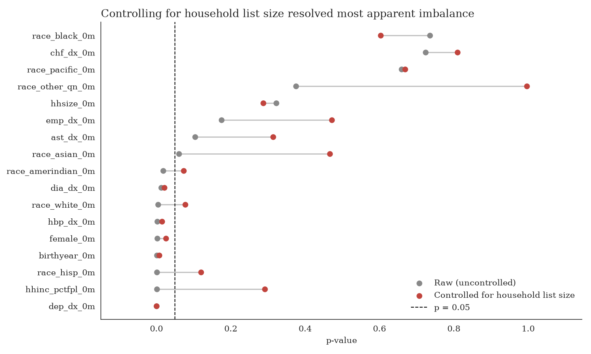
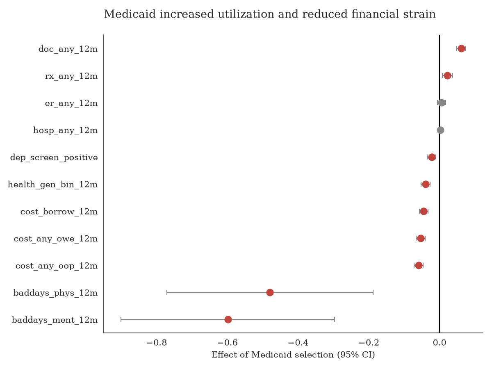
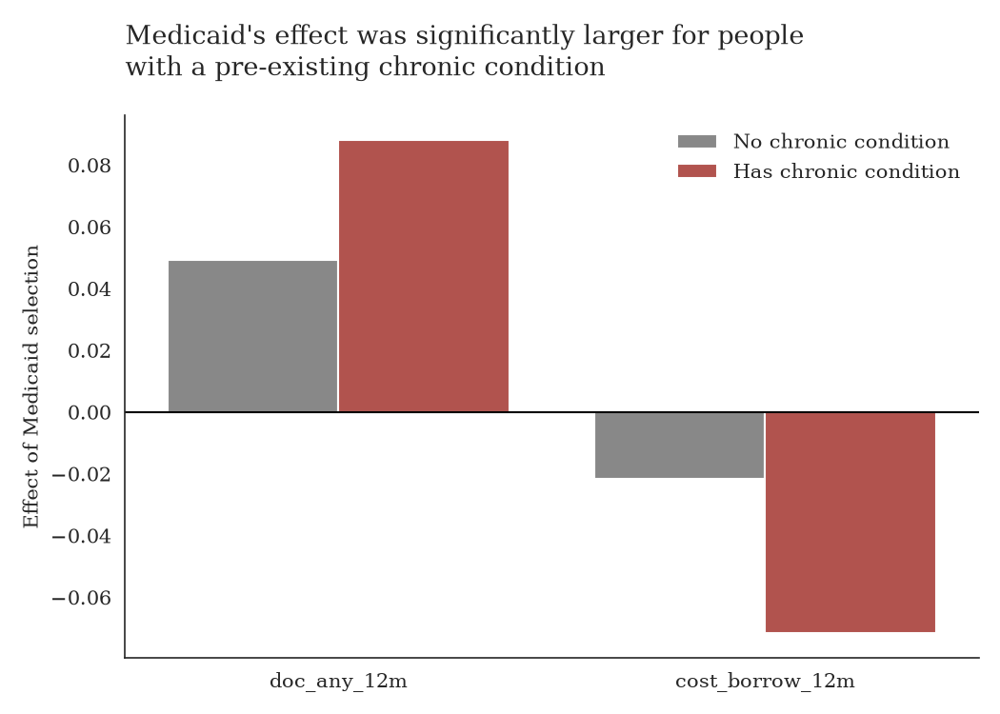

# The Oregon Health Insurance Experiment: a causal inference analysis

## Overview
In 2008, Oregon expanded Medicaid to a limited number of low-income adults
by lottery. This created one of the few large randomized controlled
trials in U.S. healthcare policy. This project uses the experiment's
public-use data to test whether winning the lottery changed healthcare
utilization, health, and financial outcomes at 12 months.

The analysis has two parts. The first replicates core results from
Finkelstein et al. (2012, Quarterly Journal of Economics), which serves
as a check on the pipeline against a published benchmark. The second is
an original extension testing whether the effect of Medicaid differed for
people with a pre-existing chronic condition.

This is a causal inference analysis of a real, already-conducted
randomized experiment, not an A/B test designed for this project.

## Data
Public-use data from the Oregon Health Insurance Experiment, obtained
from the [Harvard Dataverse mirror](https://dataverse.harvard.edu/dataset.xhtml?persistentId=doi:10.7910/DVN/SJG1ED)
of the NBER release. Four files are used: `descriptive_vars`,
`survey0m_vars` (pre-lottery baseline), `survey12m_vars` (12-month
outcomes), and `stateprograms_vars` (Medicaid enrollment records).

## Methodology
1. Merge the four files on `person_id`.
2. Check whether the lottery randomized cleanly, by comparing treatment
   and control groups on pre-lottery characteristics.
3. Compare utilization, health, and financial outcomes at 12 months
   between the two groups (an intent-to-treat comparison), using weighted
   regression to account for the survey's sampling design.
4. Estimate the minimum effect size the sample could detect, to assess
   whether null results reflect a true absence of effect or a lack of
   statistical power.
5. Compare the results against the published Finkelstein et al. (2012)
   findings.
6. Test whether the treatment effect differs for people with a
   pre-existing chronic condition, using an interaction term.

All regressions use OLS or weighted least squares rather than logistic
regression. This gives coefficients that read directly as percentage-
point changes, and matches the linear probability model used in the
original study.

## Findings

The balance check initially showed differences between treatment and
control groups on several baseline variables. This traced to a feature
of the lottery design: selection probability varied by household list
size. Controlling for this, and cross-checking against variables
recorded for the full population rather than only survey respondents,
indicated the randomization itself was sound and the remaining
differences were a survey non-response pattern.

Of 11 outcomes tested, 8 showed a statistically significant effect in the
direction reported by the original study: higher rates of doctor visits
and prescription use, improved self-reported health, fewer physically
and mentally unhealthy days, less medical debt and borrowing, and a lower
rate of screening positive for depression. Emergency room visits and
hospitalizations showed no significant effect. This matches the original
study's own survey-based results; a separate estimate of the minimum
detectable effect size (Cohen's d = 0.026) indicates the sample was large
enough that these two null results are unlikely to reflect low
statistical power.

The effect of Medicaid selection was larger for people with a
pre-existing chronic condition on two outcomes: the increase in doctor
visits was about twice as large, and the reduction in medical debt
borrowing was more than three times as large, compared with people
without a chronic condition. Both differences hold after a Bonferroni
correction for the 11 comparisons tested. No other outcome showed a
significant difference between the two groups.

## Limitations
Three baseline health conditions, diabetes, high blood pressure, and
depression, could not be checked against a full-population equivalent
during the balance check, because health status was not recorded at
lottery sign-up. This remains an open limitation of the balance check.

The utilization outcomes used here are self-reported. Administrative
hospital and emergency department records, a separate data source not
yet incorporated, produced different, significant findings in later
studies of this experiment (Taubman et al., 2014; Baicker et al., 2013).

## Tools
Python, pandas, numpy, scipy, statsmodels (regression and power
analysis), matplotlib, seaborn.

## Repository contents
- `oregon.ipynb`: analysis notebook
- `balance_check_chart.png`, `main_outcomes_chart.png`,
  `subgroup_extension_chart.png`: figures
- `README.md`: this file

## Reference
Finkelstein, A., Taubman, S., Wright, B., et al. (2012). The Oregon
Health Insurance Experiment: Evidence from the First Year. Quarterly
Journal of Economics, 127(3), 1057-1106.
